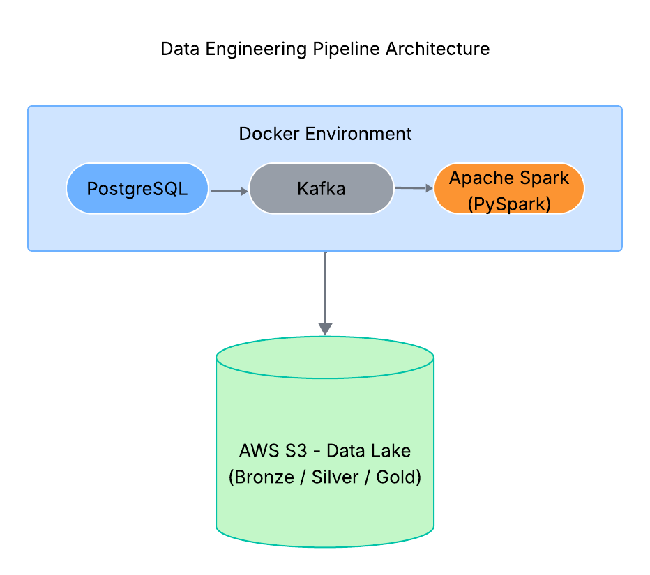

# 🚀 ETL Pipeline - Tesouro Direto IPCA

## 📌 Objetivo

Construir um pipeline completo de Engenharia de Dados utilizando:
- PostgreSQL
- Kafka
- Spark
- AWS S3
- Camadas Bronze, Silver e Gold

---

## 🏗  Arquitetura

PostgreSQL → Kafka → Spark → S3 (Bronze)
S3 Bronze → Spark → S3 Silver
S3 Silver → Spark → S3 Gold

  

---

## 🛠  Tecnologias Utilizadas

- Python
- PySpark 3.5
- Docker
- Kafka
- PostgreSQL
- AWS S3
- Hadoop AWS Connector

---

## 📊 Camadas

### Bronze

Dados brutos armazenados no S3

### Silver

Limpeza, tratamento de datas e remoção de duplicatas

### Gold

Agregações e métricas analíticas

---

## 📈 Resultados

- Métricas agregadas por tipo de título
- Armazenamento em formato Parquet
- Arquitetura escalável

---

## 🔥 Diferenciais

- Integração Kafka + Spark
- Arquitetura Lakehouse
- Uso de Docker para orquestração

