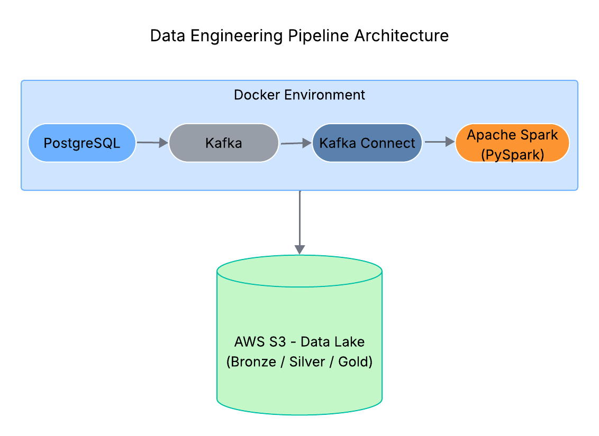

# 🚀 Pipeline de Engenharia de Dados – Arquitetura Medallion (Bronze / Silver / Gold)

## 📌 Objetivo

Construir um pipeline completo de Engenharia de Dados integrando PostgreSQL, Kafka e Apache Spark, com
armazenamento em um Data Lake no Amazon S3, seguindo o modelo Bronze, Silver e Gold.
Projeto desenvolvido como desafio final do Bootcamp de Engenharia de Dados da pós-graduação em
Engenharia e Arquitetura de Dados com IA (XP Educação).

---

## 🏗  Arquitetura da Solução

A solução foi implementada utilizando:

- PostgreSQL como base de dados

- Apache Kafka para streaming de dados

- Kafka Connect para integração e ingestão

- Apache Spark (PySpark / Spark SQL) para processamento distribuído

- Cluster Spark (Master + Worker)

- Amazon S3 como Data Lake

- Docker Compose para orquestração da infraestrutura.

  

---

## 🗂  Estrutura do Data Lake (S3)

O bucket S3 foi organizado da seguinte forma:

my-bucket-ek-1/

├─ raw-data/         # Camada Bronze (dados brutos)

├─ processed-data/   # Camada Silver (dados tratados)

├─ analytics/        # Camada Gold (dados agregados)

---

🟤 Bronze – Ingestão Bruta

- Consumo de dados a partir de fonte externa (CSV – Tesouro Direto)

- Ingestão via Kafka

- Armazenamento de dados brutos no S3

- Validação básica de esquema

- Formato de armazenamento: Parquet

⚪ Silver – Limpeza e Transformação

 Processamentos realizados:

- Remoção de duplicações

- Tratamento de valores nulos

- Padronização de colunas

- Ajustes de tipos de dados

Dados tratados são armazenados na camada processed-data/

🟡 Gold – Agregação e Métricas

- Cálculo de métricas agregadas

- Estruturação de dados para consumo analítico

- Organização da camada final em analytics/

Essa camada contém dados prontos para BI ou análises avançadas.

## 🛠  Tecnologias Utilizadas

° Python

° PySpark

° Apache Spark

° Apache Kafka

° Kafka Connect

° PostgreSQL

° Amazon S3

° Docker

---

## 📊 Conceitos Aplicados

- Arquitetura Medallion (Bronze / Silver / Gold)

- Processamento distribuído com Spark

- Integração Kafka + Spark

- Construção de Data Lake no S3

- Orquestração de serviços com Docker.

---

## 📈 Resultados

* Pipeline ETL funcional e escalável

* Integração entre banco relacional e streaming

* Estrutura organizada de Data Lake

* Armazenamento otimizado em formato Parquet

Cluster Spark distribuído via Docker.

---

## 🔥 Diferenciais

* Implementação real de Kafka Connect

* Uso de cluster Spark (Master + Worker)

* Estruturação completa do Data Lake

* Separação clara entre ingestão, transformação e agregação.

